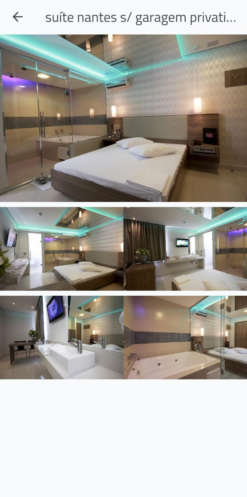
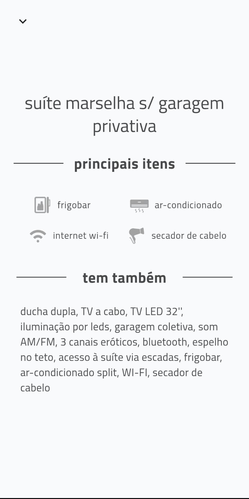
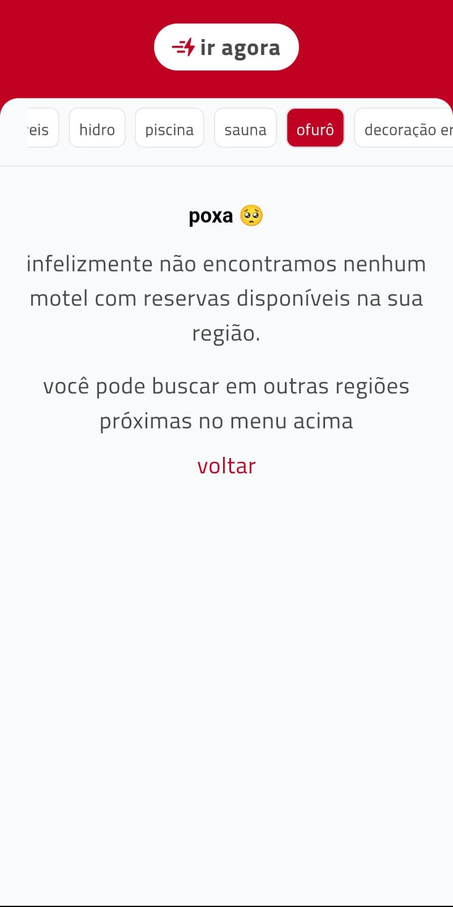

# Guia de Motéis - Clone da Página "Ir Agora"

Este é um **clone** da página de navegação **"Ir Agora"** do aplicativo _Guia de Motéis_. O projeto foi desenvolvido utilizando **Flutter**, com uma arquitetura bem estruturada e gerenciamento de estado eficiente.

*O projeto foi simplificado para se adequar a algumas necessidades.*

## **Tecnologias Utilizadas**
-   **Flutter** (Dart)
-   **ChangeNotifier** como gerenciador de estado, dispensando pacotes externos
-   **GetIt** para injeção de dependências
-   **HTTP** para requisições HTTP
-   **Mockito** para testes

O projeto segue **Clean Architecture** com separação em **Camadas**:

📂 **lib/**  
├── **data/** → Datasources e Models (com API mockada)  
├── **domain/** → Entidades e Casos de Uso  
├── **di/** → Gerenciamento de Dependências  
├── **presentation/** → UI e Controllers (ChangeNotifier)  
├── **infra/** → Configurações gerais  
├── **main.dart** → Entrada do app

## 🖼 **Screenshots**

| ||| |

## **Para rodar o projeto**

### 1️⃣ **Clone o Repositório**

```sh
git clone https://github.com/lithoykai/moteis.git
```

### 2️⃣ **Instale as Dependências**

```sh
flutter clean && flutter pub get 
```
### 3️⃣ **Execute o Projeto**


```sh 
flutter run 
```

## 🧪 **Testes**

Para rodar os testes automatizados:
*Você também pode conferir a cobertura de testes pelo lcov*

```sh
flutter test
```

## Vídeo rodando o projeto.

<video width="350" controls>
  <source src="assets/video/video.mp4" type="video/mp4">
</video>